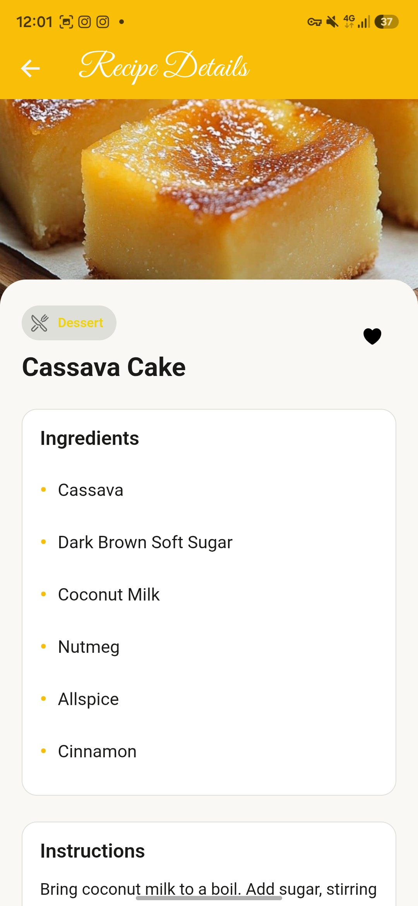
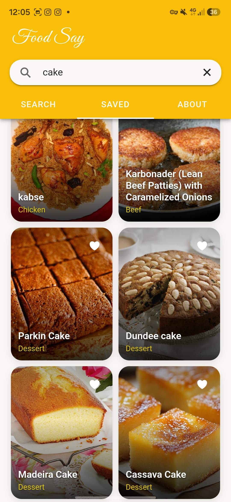
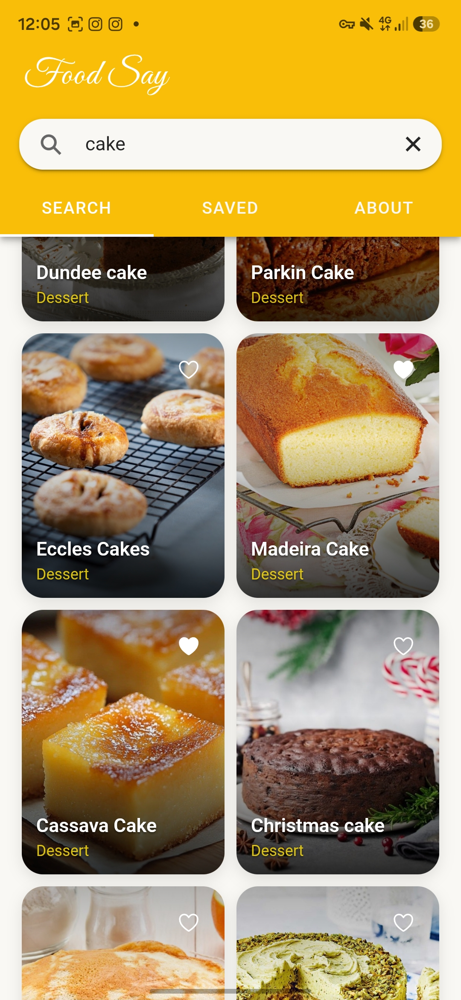

<div align="center">
  <h2>
    Food Say
  </h2>
</div>


## descrption

Discover a world of flavors right at your fingertips with Food Say, the ultimate recipe discovery app designed for home cooks, food enthusiasts, and everyone who loves delicious food. Powered by TheMealDB API, Food Say brings you an extensive collection of culinary delights from across the globe, right to your mobile device.

## Features
- Vast Recipe collection
- Smart Search
- Detailed Recipe Insights
- Saved Recipes (Favorites)
- Modern & Clean UI
- 1000+ Recipes

## Demo 📸





## Project Structure

```bash
Dockerfile
├── README.md
├── assets
│   ├── icon.png
│   └── splash.png
├── capacitor.config.ts
├── demo1.jpg
├── demo2.jpg
├── demo3.jpg
├── eslint.config.js
├── index.html
├── ionic.config.json
├── ionic.starter.json
├── package-lock.json
├── package.json
├── public
│   ├── favicon.png
│   ├── fonts
│   │   └── GreatVibes-Regular.ttf
│   └── manifest.json
├── release.md
├── src
│   ├── App.tsx
│   ├── assets
│   │   └── comfort_food_placeholder.png
│   ├── components
│   │   ├── Error.css
│   │   ├── Error.tsx
│   │   ├── FoodCard.css
│   │   ├── FoodCard.tsx
│   │   ├── Loading.css
│   │   ├── Loading.tsx
│   │   └── Seachscreen.tsx
│   ├── hook
│   │   ├── useApi.ts
│   │   └── useStorag.ts
│   ├── main.tsx
│   ├── pages
│   │   ├── About.css
│   │   ├── About.tsx
│   │   ├── FoodView.css
│   │   ├── FoodView.tsx
│   │   ├── Home.css
│   │   └── Home.tsx
│   ├── theme
│   │   └── variables.css
│   ├── utility
│   │   └── notification.ts
│   └── vite-env.d.ts
├── tsconfig.json
├── tsconfig.node.json
└── vite.config.ts
```

## LICENSE
Apache2.0

Copyright 2026 lasith ruwantha amrwansha